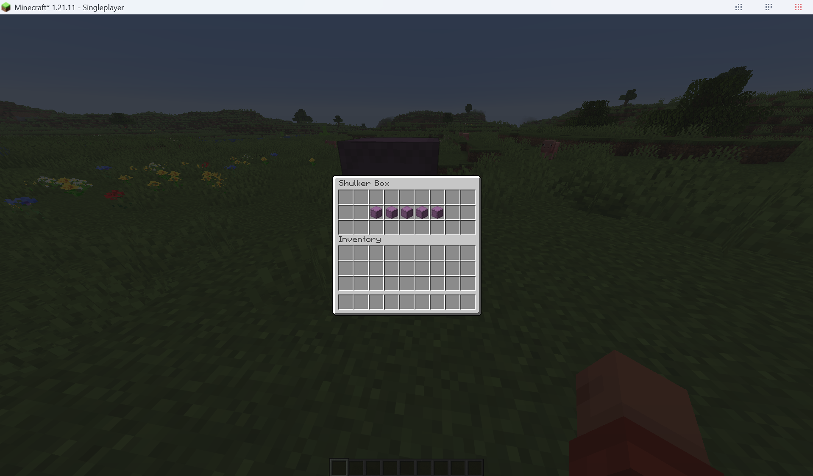

Mod for putting shulkers in shulkers
Requires Java 21 and Gradle 9.2.0
Build with gradlew.bat
made with ohio

---
SHOWCASE BELOW


---

## Usage

Nested Shulkers are **enabled by default**. Toggle at runtime, no restart needed:

- `/nanoshulker on` — allow Shulker Boxes inside Shulker Boxes
- `/nanoshulker off` — restore normal vanilla behavior

The command is client-side only and works in singleplayer and on servers without anything installed server-side.

## Installation

1. Install Minecraft Java 1.21.11 with Fabric Loader 0.18.1+ and Fabric API `0.141.1+1.21.11`.
2. Drop `nanoshulker-1.0.0.jar` (from `build/libs/`) into your client's `mods/` folder.
3. Launch the game.

## Building

```bat
gradlew.bat build
```

Requirements: JDK 21 (pinned via `org.gradle.java.home` in `gradle.properties`). The Gradle wrapper (`gradlew` / `gradlew.bat`) downloads Gradle 9.2.0 automatically.

## How it works

A Mixin injects at the head of `ShulkerBoxSlot.canInsert(ItemStack)` (`net.minecraft.screen.slot.ShulkerBoxSlot`). When the client-side flag `ClientConfig.allowNestedShulkers` is `true`, it returns `true` and skips the vanilla restriction; when `false`, vanilla runs untouched. The flag is flipped by the `/nanoshulker` client command (Fabric `ClientCommandRegistrationCallback`), never synced to the server, never persisted.

```text
src/main/java/com/nanoshulker/
├── ClientConfig.java               # allowNestedShulkers flag (default true)
├── ClientShulkerToggleCommand.java  # client entrypoint + /nanoshulker on|off
└── mixin/
    └── ShulkerBoxSlotMixin.java     # bypasses the vanilla nesting check
```

## Tech versions

| Component     | Version             |
| ------------- | ------------------- |
| Minecraft     | 1.21.11             |
| Yarn mappings | 1.21.11+build.6     |
| Fabric Loader | 0.18.1              |
| Fabric API    | 0.141.1+1.21.11     |
| Fabric Loom   | 1.14.10             |
| Gradle        | 9.2.0 (via wrapper) |
| Java          | 21                  |

## Known limitation

Slot clicks are server-authoritative, so on a strict vanilla dedicated server the server may reject the move and the item snaps back. Fully effective in singleplayer (the integrated server shares the client JVM, so the Mixin applies there too). This is inherent to any client-only approach.
